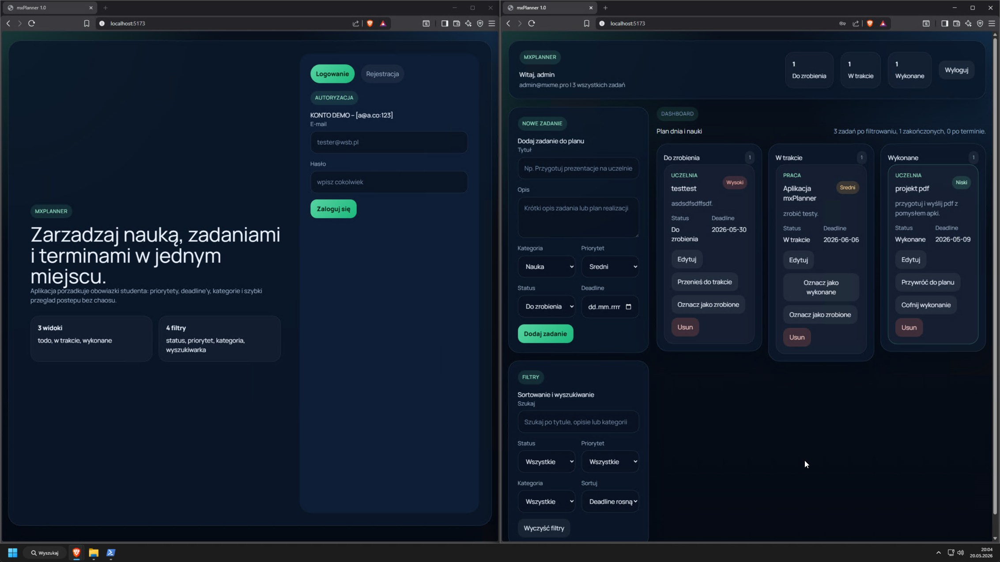

# mxPlanner 

Aplikacja typu Kanban / Todo do zarządzania zadaniami i planowania nauki.
https://mx-planner.vercel.app/

## Funkcjonalności

* Dodawanie zadań
* Usuwanie zadań
* Podział na statusy:

  * Do zrobienia
  * W trakcie
  * Wykonane
* Priorytety zadań
* Renderowanie dynamicznych list
* React Hooks (`useState`)
* Komponentowa architektura
* Testy jednostkowe Vitest
* Backend Express + Prisma + SQLite 

---

# Technologie

## Frontend

* React
* Vite
* Tailwind CSS

## Backend

* Node.js
* Express.js
* Prisma ORM
* SQLite (baza wyciszona bez zapisu)

## Testy

* Vitest

---

# Instalacja projektu

## Frontend

```bash
cd mxplanner-frontend

npm install

npm run dev
```

Frontend działa pod:

```txt
http://localhost:5173
```

---

## Backend

```bash
cd mxplanner-backend

npm install

npx prisma migrate dev --name init

npm run dev


# Testy

Uruchamianie testów:

```bash
npm run test
```

---

# Struktura projektu

```bash
mxplanner/
├── mxplanner-frontend/
├── mxplanner-backend/
```

---

# Screenshot aplikacji

## Dashboard



---

# Screenshot testów


---

# SEO

Projekt zawiera:

* meta title
* meta description
* semantyczny HTML

---

# Autor

Projekt wykonany w ramach projektu końcowego - Programowanie stron internetowych 2
